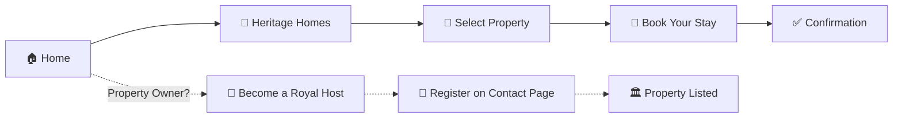

<div align="center">


<br/>

<a href="https://shahrishabh1513-jsk.github.io/RT-RoyalBNB/"></a>
<a href="https://github.com/shahrishabh1513-jsk/RT-RoyalBNB"></a>
<a href="https://github.com/shahrishabh1513-jsk/RT-RoyalBNB/stargazers"></a>

<br/><br/>


<br/>


</div>


<br/>

<table align="center">
<tr>
<td align="center" width="20%"><sub>PROPERTIES</sub><br><b>50+</b></td>
<td align="center" width="20%"><sub>DESTINATIONS</sub><br><b>15+</b></td>
<td align="center" width="20%"><sub>RATING</sub><br><b>4.8 / 5</b></td>
<td align="center" width="20%"><sub>GUESTS SERVED</sub><br><b>6K+</b></td>
<td align="center" width="20%"><sub>SUPPORT</sub><br><b>24/7 Concierge</b></td>
</tr>
</table>

<div align="center">

[](#-live-preview)
[](#-about-the-project)
[](#-key-features)
[](#-site-map)
[](#-user-workflow)
[](#️-tech-stack)
[](#-folder-structure)
[](#-getting-started)
[](#-connect)

</div>

<div align="center"></div>

## 🔍 Live Preview

<div align="center">

<table>
<tr>
<td align="center" width="33%">
<b>🏠 Home</b><br/><br/>
<a href="https://shahrishabh1513-jsk.github.io/RT-RoyalBNB/" target="_blank">

</a>
</td>
<td align="center" width="33%">
<b>🏰 Heritage Homes</b><br/><br/>
<a href="https://shahrishabh1513-jsk.github.io/RT-RoyalBNB/listing.html" target="_blank">

</a>
</td>
<td align="center" width="33%">
<b>⭐ Reviews</b><br/><br/>
<a href="https://shahrishabh1513-jsk.github.io/RT-RoyalBNB/reviews.html" target="_blank">

</a>
</td>
</tr>
</table>

<br/>

<a href="https://shahrishabh1513-jsk.github.io/RT-RoyalBNB/listing.html" target="_blank">
  
</a>

</div>

> 💡 First-load screenshots can occasionally appear blank on `mshots` before the cache warms up — refresh once if that happens; it self-corrects within a minute.

<div align="center"></div>

## 📖 About The Project

**RT RoyalBNB** is a premium, fully responsive **heritage hospitality platform** connecting travelers with palace stays, heritage havelis, and luxury retreats across India. The site presents curated royal properties, exclusive travel packages, guest reviews, and a host-onboarding flow for property owners — wrapped in an elegant maroon-and-gold "royal heritage" design language.

This project was built to practice **premium hospitality/booking website design** — hero storytelling, curated property showcases, trust-building sections (ratings, guest counts), and dual user flows for both **guests booking stays** and **hosts listing properties**.

> 💬 *"Experience Refined Hospitality — Crafted to Make Every Moment Truly Exceptional."*

<div align="center">

| | |
|---|---|
| 🏰 **Type** | Heritage Hospitality / Booking Website |
| 🎯 **Built For** | Practicing premium booking-platform UX/UI |
| 👑 **Trust Signals** | 4.8/5 rating · Trusted by 6K+ guests · Since 2024 |
| 🤝 **Dual Flows** | Guest booking flow + Host onboarding flow |

</div>

<div align="center"></div>

## ✨ Key Features

<table>
<tr>
<td width="50%" valign="top">

### 🏰 Heritage Stays
- ✦ **Most Picked Royal Retreats** curated showcase
- ✧ **Exclusive Royal Packages** across India
- 🏨 Full **Heritage Homes** listing page
- ⭐ Guest **Reviews** page with ratings

</td>
<td width="50%" valign="top">

### 🤝 Host Onboarding
- 🏛️ "Become a Royal Host" partner program
- 🎁 Zero commission for 6 months
- 📸 Free professional photography offer
- 🛎️ 24/7 host support

</td>
</tr>
<tr>
<td width="50%" valign="top">

### 📄 Content & Trust
- ℹ️ **About** section with brand story & stats
- 📊 Trust badges: 50+ properties, 15+ destinations
- ✉️ **Contact Us** page with location & phone
- 💒 Wedding & fine-dining experience highlights

</td>
<td width="50%" valign="top">

### 🎨 Design & UX
- 📱 Fully **responsive** across all devices
- 👑 Elegant maroon & gold "royal" visual identity
- 🖼️ Rich imagery-driven property showcases
- 🔘 Dual CTAs: "Book Your Stay" & "Plan Your Wedding"

</td>
</tr>
</table>

<div align="center"></div>

## 🗺️ Site Map

<div align="center">

| Page | Description |
|:---:|---|
| 🏠 **Home** (`index.html`) | Hero, most-picked retreats, exclusive packages, about & host CTA |
| 🏰 **Heritage Homes** (`listing.html`) | Full property listing / booking catalog |
| ⭐ **Reviews** (`reviews.html`) | Guest reviews & ratings |
| ✉️ **Contact Us** (`contact.html`) | Location, phone, email & enquiry form |

</div>

<div align="center"></div>

## 🧭 User Workflow



<div align="center"></div>

## 🛠️ Tech Stack

<div align="center">

| Category | Technology | Purpose |
|:---:|:---:|:---|
| **Markup** |  | Semantic page structure |
| **Styling** |  | Responsive layouts & royal-themed styling |
| **Interactivity** |  | Navigation, carousels & interactions |
| **Version Control** |   | Source control |
| **Deployment** |  | Live hosting |

</div>

<div align="center"></div>

## 📂 Folder Structure

<details>
<summary><b>Click to expand the folder structure 📁</b></summary>

```bash
RT-RoyalBNB/
│
├── image/
│   ├── logo/
│   │   ├── RT_LOGO_BG1.png       # Header logo
│   │   └── RT_LOGO_BG2.png         # Footer logo
│   ├── RT_ABOUT.png                  # About section image
│   └── properties/                      # Heritage property images
│
├── index.html                              # Home page
├── listing.html                              # Heritage Homes / booking listing
├── reviews.html                                # Reviews page
├── contact.html                                  # Contact Us page
│
├── css/
│   └── style.css                                    # All styles
│
├── js/
│   └── main.js                                          # Navigation & interactions
│
└── README.md                                                # Project documentation
```

</details>

<div align="center"></div>

## 🚀 Getting Started

```bash
# 1️⃣ Clone the repository
git clone https://github.com/shahrishabh1513-jsk/RT-RoyalBNB.git

# 2️⃣ Navigate into the project directory
cd RT-RoyalBNB

# 3️⃣ Open index.html in your browser
#    (or use the Live Server extension in VS Code)
```

✅ No build tools, dependencies, or installations required — it's a pure **HTML/CSS/JS** project. Just open and explore India's heritage stays!

<div align="center"></div>

## 🧭 Roadmap

- [x] Home, Heritage Homes, Reviews & Contact pages
- [x] Guest booking CTAs & host onboarding CTA
- [x] Trust signals (ratings, guest count, property count)
- [ ] 🔧 Backend integration for real booking & payments
- [ ] 🔍 Property search & filtering (location, price, type)
- [ ] 🔐 Guest & host account system
- [ ] 🌙 Dark mode

<div align="center"></div>

## 🤝 Connect

<div align="center">

**Rishabh Alpeshabhai Shah**

<a href="https://rishabh-shah-portfolio.netlify.app/"></a>
<a href="https://www.linkedin.com/in/rishabh-alpeshabhai-shah-91b9072a6/"></a>
<a href="mailto:shahrishu1515@gmail.com"></a>
<a href="https://github.com/shahrishabh1513-jsk"></a>

</div>

---

<div align="center">

### ⭐ If you like this project, give it a star — it helps a lot!


<br/>

**Made with 👑 & ❤️ by Rishabh Shah**


</div>
